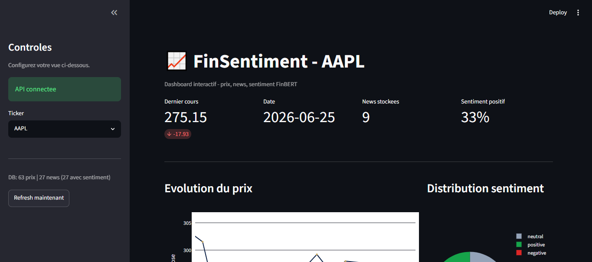
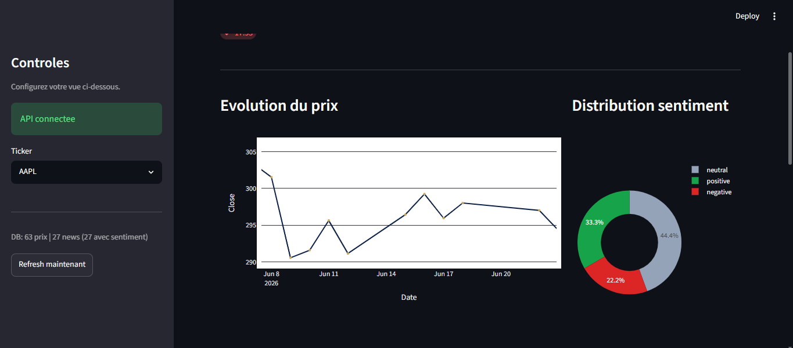
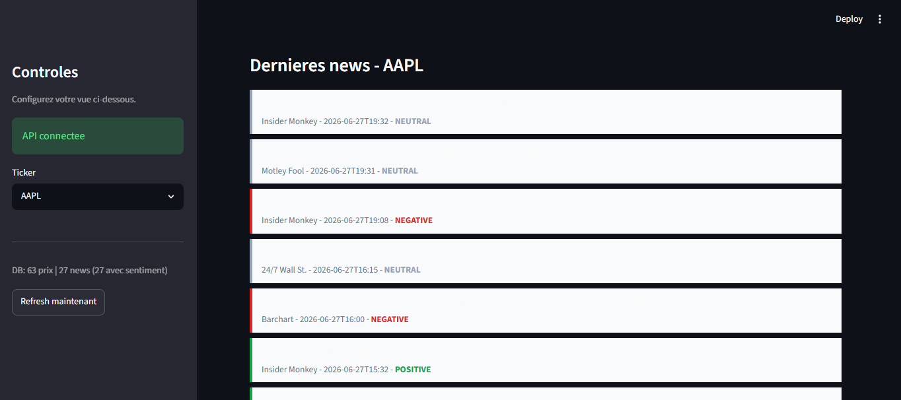
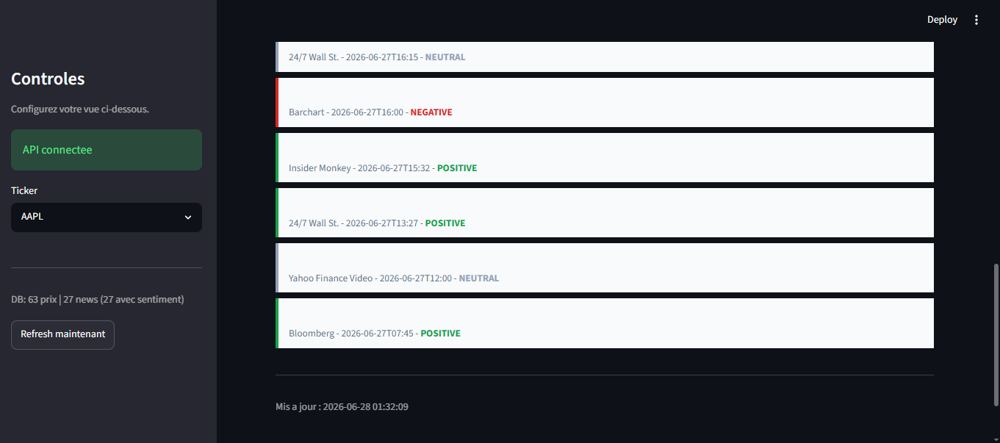

# FinAPI — API Flask + ETL + SQLite

## Installation

python -m venv .venv
source .venv/bin/activate
pip install -r requirements.txt

## Lancement du serveur

python -m finapi.app

## Ingestion des données

python -m scripts.run_etl AAPL MSFT GOOGL

## Endpoints Lab 1

curl http://localhost:5000/health
curl http://localhost:5000/price/AAPL
curl http://localhost:5000/history/AAPL?days=5

## Endpoints Lab 2

curl http://localhost:5000/db/prices/AAPL
curl http://localhost:5000/db/news/MSFT

## Endpoints Lab 3

curl -X POST http://localhost:5000/sentiment -H "Content-Type: application/json" -d '{"text": "Apple stock soared after earnings."}'
curl -X POST http://localhost:5000/sentiment/batch -H "Content-Type: application/json" -d '{"texts": ["Apple soared", "Tesla missed"]}'
curl http://localhost:5000/db/sentiment-summary/AAPL

## Enrichissement des sentiments

python -m scripts.enrich_sentiment

## Lancer le dashboard

### Prérequis
Assure-toi que l'environnement virtuel est activé et les dépendances installées :
```bash
pip install streamlit plotly requests
```

### Lancement

**Terminal 1 — API Flask :**
```bash
python -m finapi.app
```

**Terminal 2 — Dashboard Streamlit :**
```bash
streamlit run dashboard/app.py
```

Ouvre ensuite http://localhost:8501 dans ton navigateur.

### Aperçu






